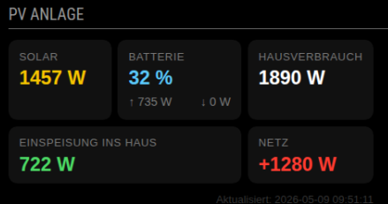

# MMM-AnkerSolixMQTT

A [MagicMirror²](https://magicmirror.builders/) module that displays real-time power data from the **Anker Solix Solarbank 3 E2700 Pro (A17C5)** and **Anker Smart Meter (A17X7)** via MQTT.



> **Note:** This module was developed with the assistance of [Claude](https://claude.ai) by Anthropic.

---

## Features

- ⚡ Real-time data updates every ~3 seconds via MQTT
- ☀️ Solar power output (W)
- 🔋 Battery state of charge (%) with charge/discharge power
- 🏠 Power feed into the house (W)
- 💡 Current home consumption (W)
- 🔌 Grid power: import (positive) or export (negative)
- Compact 3×2 tile layout inspired by the Anker app

---

## Dependencies

This module requires the **Anker Solix API** Python library by [thomluther](https://github.com/thomluther/anker-solix-api):

> 👉 [https://github.com/thomluther/anker-solix-api](https://github.com/thomluther/anker-solix-api)

The Python poller script (`solix_mqtt_poller.py`) uses this library to connect to the Anker MQTT cloud server and writes real-time data to a local JSON file, which the MagicMirror module reads.

---

## Tested Hardware

| Device | Model | Role |
|---|---|---|
| Anker Solix Solarbank 3 E2700 Pro | A17C5 | Solar + Battery data |
| Anker Smart Meter | A17X7 | Grid import/export data |

---

## Requirements

- Raspberry Pi running MagicMirror²
- Python 3.12 or higher
- Anker account (main account with admin rights — guest accounts do not have MQTT access)
- Anker Solix Solarbank 3 connected together with the Anker Smart Meter in the Anker app

---

## Installation

### Step 1 — Clone the Anker Solix API

```bash
cd ~
git clone https://github.com/thomluther/anker-solix-api.git
cd anker-solix-api
```

### Step 2 — Install Python 3.12

> Raspberry Pi OS Bullseye does not include Python 3.12 in its package manager. Build from source:

```bash
sudo apt install -y build-essential libssl-dev libffi-dev zlib1g-dev \
  libreadline-dev libsqlite3-dev libbz2-dev libncurses-dev \
  libgdbm-dev liblzma-dev tk-dev wget

cd /tmp
wget https://www.python.org/ftp/python/3.12.9/Python-3.12.9.tgz
tar -xzf Python-3.12.9.tgz
cd Python-3.12.9
./configure --enable-optimizations
make -j$(nproc)
sudo make altinstall

python3.12 --version
```

### Step 3 — Create a virtual environment

```bash
cd ~/anker-solix-api
python3.12 -m venv venv
source venv/bin/activate
pip install cryptography aiohttp aiofiles paho-mqtt python-dotenv
```

### Step 4 — Configure credentials

Create a `.env` file in the `anker-solix-api` directory:

```bash
nano ~/anker-solix-api/.env
```

```env
ANKERUSER="your@email.com"
ANKERPASSWORD="yourPassword"
ANKERCOUNTRY="DE"
```

> ⚠️ Use your **main Anker account** (admin). Guest/shared accounts are denied MQTT subscription by the Anker broker.

### Step 5 — Export your system data (recommended)

Run the export tool once to verify your system is detected correctly:

```bash
cd ~/anker-solix-api
source venv/bin/activate
python export_system.py
```

Select all services (`a`), skip MQTT export for now. Check the exported JSON files to verify your device serial numbers.

### Step 6 — Copy the poller script

Copy `solix_mqtt_poller.py` from this repository into the `anker-solix-api` directory:

```bash
cp solix_mqtt_poller.py ~/anker-solix-api/solix_mqtt_poller.py
```

Edit the serial numbers at the top of the script to match your devices:

```python
SN_SOLARBANK = "YOUR_SOLARBANK_SERIAL"
SN_SMARTMETER = "YOUR_SMARTMETER_SERIAL"
```

> You can find your serial numbers in the exported JSON files from Step 5, or in the Anker app under device settings.

### Step 7 — Test the poller

```bash
cd ~/anker-solix-api
source venv/bin/activate
python solix_mqtt_poller.py
```

You should see real-time output like:

```
[08:25:03] Authentifiziere...
[08:25:04] Starte MQTT-Session...
[08:25:04] Gerät registriert: AL3DJQD0F52700605
[08:25:04] Gerät registriert: AUJS020F25108568
[08:25:04] Starte message_poller...
[08:25:07] Solar: 1740W | Bat↑: 542W ↓: 0W 99% | Einspeisung: 1198W | Haus: 1809W | Netz: 614W
```

### Step 8 — Install as a systemd service

```bash
sudo nano /etc/systemd/system/solix-mqtt-poller.service
```

```ini
[Unit]
Description=Anker Solix MQTT Poller für MagicMirror
After=network-online.target
Wants=network-online.target

[Service]
Type=simple
User=pi
WorkingDirectory=/home/pi/anker-solix-api
ExecStart=/home/pi/anker-solix-api/venv/bin/python /home/pi/anker-solix-api/solix_mqtt_poller.py
Restart=always
RestartSec=30

[Install]
WantedBy=multi-user.target
```

```bash
sudo systemctl daemon-reload
sudo systemctl enable solix-mqtt-poller
sudo systemctl start solix-mqtt-poller
sudo systemctl status solix-mqtt-poller
```

### Step 9 — Install the MagicMirror module

```bash
cp -r MMM-AnkerSolixMQTT ~/MagicMirror/modules/
```

### Step 10 — Add to MagicMirror config

Edit `~/MagicMirror/config/config.js` and add:

```javascript
{
    module: "MMM-AnkerSolixMQTT",
    position: "top_right",
    header: "Anker Solix",
    config: {
        updateInterval: 5000,
        dataFile: "/home/pi/solix_mqtt_data.json"
    }
},
```

Then restart MagicMirror:

```bash
pm2 restart MagicMirror
```

---

## Configuration Options

| Option | Default | Description |
|---|---|---|
| `updateInterval` | `5000` | Interval in ms to read the JSON file (MQTT updates arrive every ~3s) |
| `dataFile` | `/home/pi/solix_mqtt_data.json` | Path to the JSON file written by the poller |
| `animationSpeed` | `0` | DOM update animation speed in ms (0 = instant) |

---

## How it works

```
Anker Devices (Solarbank + Smart Meter)
        ↓  MQTT (~3 seconds)
Anker Cloud MQTT Broker (aiot-mqtt-eu.anker.com)
        ↓
solix_mqtt_poller.py  (Python, runs as systemd service)
        ↓  writes every update
/home/pi/solix_mqtt_data.json
        ↓  reads every 5 seconds
MMM-AnkerSolixMQTT (Node.js / MagicMirror)
        ↓
MagicMirror Display
```

---

## Data fields

The poller writes the following fields to the JSON file:

| Field | Description |
|---|---|
| `solar_power_w` | Total solar generation in W |
| `bat_charging_w` | Battery charging power in W |
| `bat_discharging_w` | Battery discharging power in W |
| `battery_pct` | Battery state of charge in % |
| `einspeisung_w` | Power fed into house (Solar + Bat discharge − Bat charge) |
| `home_load_w` | Current home consumption in W |
| `grid_power_w` | Grid power in W (positive = import, negative = export) |
| `updated_at` | Timestamp of last update |
| `error` | Error message if something went wrong, otherwise null |

---

## Important notes

- **MQTT requires the main Anker account.** Guest or shared accounts are rejected by the Anker MQTT broker with error 128.
- **This uses an unofficial API.** Anker may change their cloud API or MQTT broker at any time, which could break this module.
- The MQTT real-time trigger times out after 60 seconds of inactivity. The poller handles reconnection automatically via `Restart=always` in the systemd service.
- At night when there is no solar activity, the Anker devices may send fewer or no MQTT messages. The last known values remain in the JSON file until new data arrives.

---

## Credits

- Module developed by [utzl](https://github.com/utzl) with AI-assisted programming by [Claude](https://claude.ai) (Anthropic)
- Anker Solix API by [thomluther](https://github.com/thomluther/anker-solix-api)
- Built for [MagicMirror²](https://magicmirror.builders/)

---

## License

MIT
